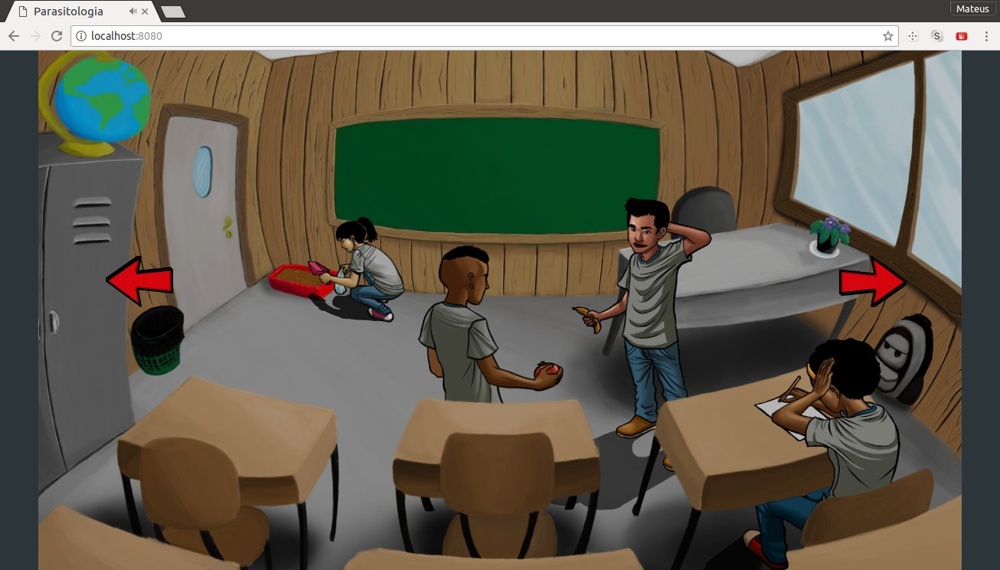
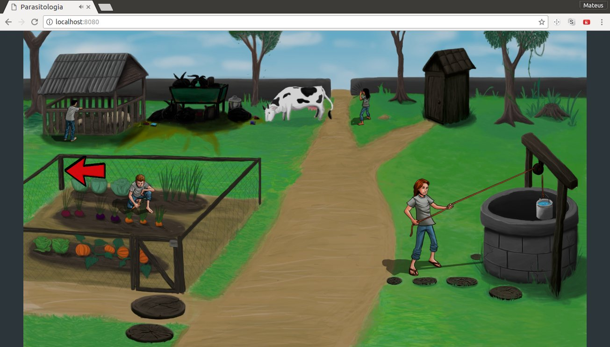
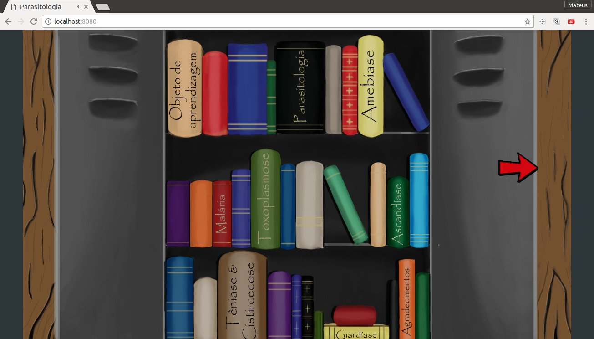
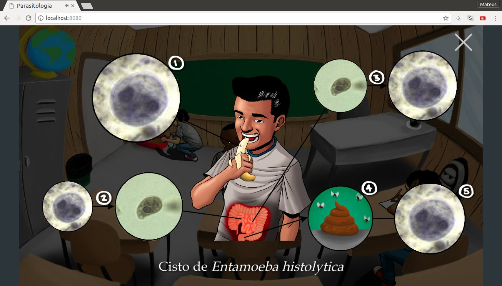
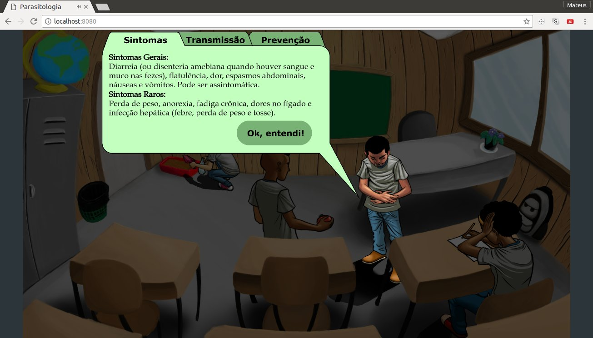
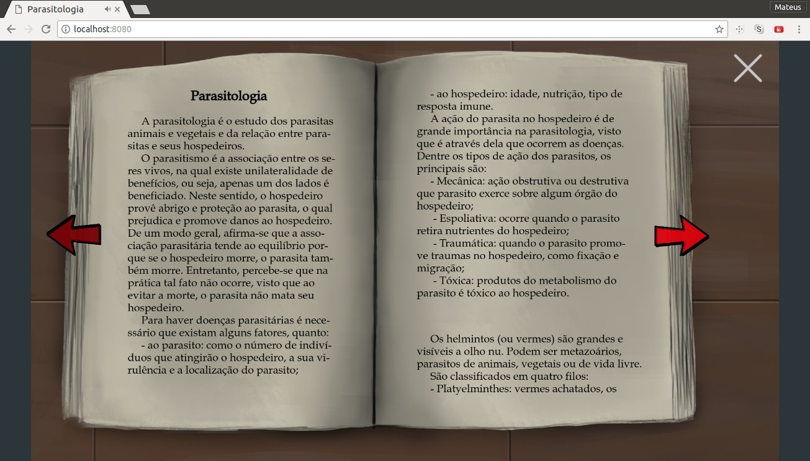

# Idiomas | Languages | 言語
- [Português](#Índice)
- [English](#index)
- [日本語](#目次)

---

# Índice
1. [Sobre o jogo](#sobre-o-jogo)
2. [Capturas de tela](#capturas-de-tela)
3. [Equipe](#equipe)
4. [Créditos](#créditos)

## Sobre o jogo
Este jogo foi desenvolvido com o objetivo de ensinar parasitologia para estudantes do Ensino fundamental.
Ele é composto por 3 cenas, que são a Sala de Aula, Cena Exterior e Armário.

Existem 8 estudantes no total, sendo 4 na Sala de Aula e outros 4 na Cena Exterior.
No jogo, cada estudante é afetado por um parasita e fica doente.
Durante as interações, o jogador entende o porquê de o estudante ter ficado doente, e aprende de que maneiras ele pode se previnir daquela doença.

[Voltar ao topo da página](#top)

## Capturas de tela

### Cena da Sala de Aula:
Sala de aula com 4 estudantes.

### Cena Exterior:
Cena exterior com outros 4 estudantes.

### Cena do Armário:
Armário com 10 livros clicáveis.

### Ciclo de uma doença:
Ao clicar em um estudante, é possível ver qual é o ciclo do parasita que causa a doença.

### Sintomas, Transmissão e Prevenção:
Após ver o ciclo, é possível ler quais são os sintomas, tranmissão e prevenção da doença.

### Livro
Na cena do armário, é possivel ler livros para aprender mais sobre parasitologia ou alguma doença parasitária em específico.

[Voltar ao topo da página](#top)

## Equipe
Autoras (Estudantes de Biologia):
- Isabella Brosens Barros
- Karina Nomidome de Senna

Desenvolvedor:
- Mateus Gonçalez Etto

Designers:
- Heitor Vasconcelos de Queiroz
- Matheus Barbosa Peixoto

[Voltar ao topo da página](#top)

## Créditos
Este projeto utilizou códigos externos e bibliotecas. Crédito para os respectivos criadores.

- [Pixijs](https://github.com/pixijs/pixi.js)
- [scaleToWindow](https://github.com/kittykatattack/scaleToWindow)
- [pixi-multistyle-text](https://github.com/tleunen/pixi-multistyle-text)

[Voltar ao topo da página](#top)

---

# Index
1. [About the game](#about-the-game)
2. [Screenshots](#screenshots)
3. [Team](#team)
4. [Credits](#credits)

## About the game
This game was developed with the objective to teach parasitology to Elementary School students.
It has 3 scenes, that are Classroom, External Scene and the Wardrobe.

There are 8 students, 4 in the Classroom, and 4 at External Scene.
In the game, each student is affected by a parasite and gets sick.
During the interactions, the player understands why the student got sick, and learns how to prevent that illness.

[Back to top](#top)

## Screenshots

### Classroom Scene:
Classroom with 4 students.

### External Scene:
External Scene with other 4 students.

### Wardrobe Scene:
Wardrobe with 10 interactive books.

### Illness cicle:
After clicking a student, it is possible to see the parasite's cicle that causes the disease.

### Symptoms, Transmission and Prevention:
After seeing the cycle, it is possible to read the symptoms, transmission and prevention of the illness.

### Book
At the Wardrobe Scene, it is possible to read book and learn more about parasitology or its specifics diseases.

[Back to top](#top)

## Team
Authors (Biology Students):
- Isabella Brosens Barros
- Karina Nomidome de Senna

Developer:
- Mateus Gonçalez Etto

Designers:
- Heitor Vasconcelos de Queiroz
- Matheus Barbosa Peixoto

[Back to top](#top)

## Credits
This project used external code and libraries. Credit for the respective creators.

- [Pixijs](https://github.com/pixijs/pixi.js)
- [scaleToWindow](https://github.com/kittykatattack/scaleToWindow)
- [pixi-multistyle-text](https://github.com/tleunen/pixi-multistyle-text)

[Back to top](#top)

---

# 目次
1. [ゲームについて](#ゲームについて)
2. [スクリーンショット](#スクリーンショット)
3. [チーム](#チーム)
4. [著作権](#著作権)

## ゲームについて
このゲームは、小学生に寄生虫学を教える目的で開発されました。
３つのシーンがあります。教室、外部シーンと本棚です。

8人の学生がいます。4人は教室、他の4人は外部シーンにいます。
ゲーム中、それぞれの学生は寄生虫で病気になってしまいます。
学生にクイックしたら、なぜ学生が病気になったか、なんで予防できるか、プレイヤーがが分かるようになります。

[トップに戻る](#top)

## スクリーンショット

### 教室のシーン：
教室と4人の学生。

### 外部シーン：
外部シーンと他の4人の学生。

### 本棚のシーン：
本棚と１０冊のインタラクティブ本

### 病気のサイクル：
学生にクリックすると、寄生虫と病気のサイクルが見えます。

### 兆候、感染、予防：
サイクルを見た後、病気の兆候、感染と予防について読めます。

### 本
本棚のシーンで、本で寄生虫学とその病気について読めます。

[トップに戻る](#top)

## チーム
著者 （生物学の学生）：
- Isabella Brosens Barros
- Karina Nomidome de Senna

開発者：
- Mateus Gonçalez Etto

デザイナー：
- Heitor Vasconcelos de Queiroz
- Matheus Barbosa Peixoto

[トップに戻る](#top)

## 著作権
このプロジェクトでは外部のコードとライブラリーが使われました。これらのクレジットはそれぞれのクリエーターです。

- [Pixijs](https://github.com/pixijs/pixi.js)
- [scaleToWindow](https://github.com/kittykatattack/scaleToWindow)
- [pixi-multistyle-text](https://github.com/tleunen/pixi-multistyle-text)

[トップに戻る](#top)
